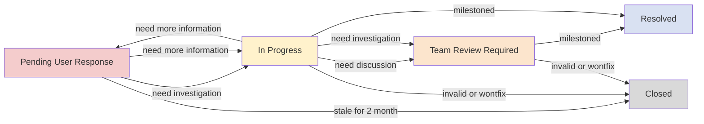

# Duty Duration

* A sprint, 2 weeks
* Start from the first day after the first-week meeting
* Finish after the second-week meeting

# Responsibility

## GitHub Issues

Review the GitHub issues ensure clarity in the issue description, and understand how the user encountered the problem. If the description appears to be unclear, kindly ask the user to provide additional information, such as step-by-step instructions to reproduce the issue or a support bundle. If the user encounters difficulty attaching the support bundle to the issue, suggest the user to send it to [harvester-support-bundle@suse.com](mailto:harvester-support-bundle@suse.com). The subject format is `[Issue xxxx] Support Bundle`.

Check for existing issues to determine if there is a duplication. Users running older Harvester versions may face known issues specific to those versions. Therefore, we can review the codebase and existing issues to confirm if the problem has already been addressed.

Community issue review statuses:
- **New:** The initial status when an issue is created.
- **In progress:** Active issue review.
- **Pending user response:** Awaiting further details from the user.
- **Team review required:** Indicates that the issue needs discussion with the team during the community issue meeting.
- **Resolved:** Indicates the issue is well-understood and scheduled for development.
- **Closed:** Indicates the issue has been determined not to be fixed.
- **Ice Box:** Denotes that the root cause of the issue is yet to be determined.

It is good to provide a response to the user by commenting on the issue, outlining the progress and the potential actions to be taken. This not only acknowledges the user's issue but also clarifies potential actions being considered.

For all resolved issues without milestone, just add to Planning milestone.

## Flow

### Sprint and Status Flow

| Trigger Event                                | Triggered by            | Status     | Sprint       |
|---------------------------------------------|-------------------------|------------|--------------|
| created                                     | non-team member     | New        | to current      |
| milestoned                                  | team member         | Resolved   | to current      |
| closed                                      | any user             | Closed     | not changed  |
| reopened                                    | any user            | In Progress| to current      |
| comment added or edited + Status is not Resolved and not Closed| non-team member | In Progress| to current  |
| labeled as invalid, wontfix or duplicated   | team member         | Closed     | not changed  |

