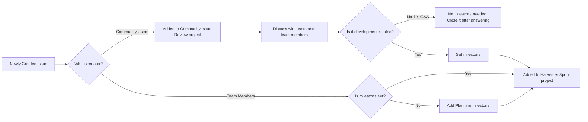

> [!Note]
> About each sprint project, please check [[Sprint Project Boards]]. 

We manage issues in two separate workflows:

* [Harvester Sprint - Issue Management](https://github.com/harvester/harvester/wiki/Harvester-Developer-Issue-Management)
* [Community Sprint - Issue Management](https://github.com/harvester/harvester/wiki/Community-Issue-Management)

The core concept is that an issue can be added to the **Harvester Sprint** once it contains **sufficient information** and **has been assigned a milestone**.

## General Issue Flow

* When an issue is created:
  * If the creator is not a member of the organization, the issue is added to the [Community Issue Management](https://github.com/harvester/harvester/wiki/Community-Issue-Management).
  * If the creator is a member of the organization, the issue is added to the [Harvester Developer Issue Management](https://github.com/harvester/harvester/wiki/Harvester-Developer-Issue-Management) with the default Planning milestone.
* Once an issue in [Community Issue Management](https://github.com/harvester/harvester/wiki/Community-Issue-Management) has sufficient information and has been assigned a milestone:
  * Update status to `Resolved` in [Community Issue Management](https://github.com/harvester/harvester/wiki/Community-Issue-Management).
  * Move it to [Harvester Developer Issue Management](https://github.com/harvester/harvester/wiki/Harvester-Developer-Issue-Management)
* If the issue is addressed, please close it directly.

## Issues From [Community Issue Review](https://github.com/orgs/harvester/projects/10) To [Harvester Sprint](https://github.com/orgs/harvester/projects/7)

## GitHub Action Workflows

> [!Important]
> The workflows described below may change over time. For the exact settings, please refer to the workflows defined in https://github.com/harvester/harvester/tree/master/.github/workflows/issue-management-*.yml.

### Issue Creation and Auto-Categorization

When a new issue is created, the system automatically categorizes it based on the creator’s identity:

- [Harvester Team Members](https://github.com/harvester/harvester/blob/master/.github/workflows/issue-management-update-harvester-projects.yaml)
- [Community Coordinators](https://github.com/harvester/harvester/blob/master/.github/workflows/issue-management-update-community-projects.yaml)

### [Sprint Cycle Management](https://github.com/harvester/harvester/blob/master/.github/workflows/issue-management-update-issue-sprint.yml)

Sprint updates are automatically executed every Sunday at 20:00.

Harvester Sprint (Project #7):
* Move issues with the “Review” status to the next sprint
* Remove issues from the current sprint if their status is not one of: Review, Ready For Testing, Testing, or Closed

Community Sprint (Project #10):

* Move issues with the “New” status to the next sprint

QA Sprint (Project #20):

* Move issues with the “In Review” status to the next sprint
* Remove issues from the current sprint if their status is not In Review or Done

### [Issue Stale Management](https://github.com/harvester/harvester/blob/master/.github/workflows/issue-management-stale.yml)

* Runs daily at 1:30 AM to check activity of issues and PRs
* Close unactivated issues and PRs

### [Backport Issue Management](https://github.com/harvester/harvester/blob/master/.github/workflows/issue-management-create-issue-by-label.yaml)

Sometimes, older versions might need to be patched due to CVEs or bug fixes. We'll use the `backport-needed/xxx` label to help us create the corresponding issue.