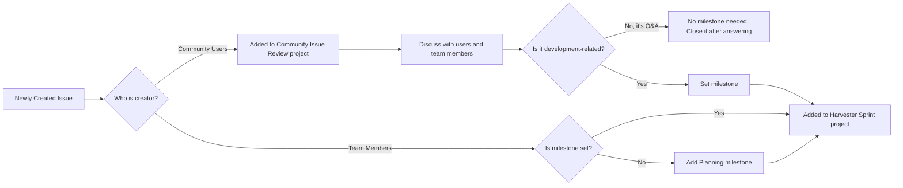

## Introduction

We manage issues in two separate workflows:

- [Harvester Developer Issue Management](https://github.com/harvester/harvester/wiki/Harvester-Developer-Issue-Management) (Harvester Sprint Project #7)
- [Community Issue Management](https://github.com/harvester/harvester/wiki/Community-Issue-Management) (Community Sprint Project (#10)

The core concept is that an issue can be added to the **Harvester Developer Issue Management** once it contains **sufficient information** and **has been assigned a milestone**.

The general flow is as follows:

- When an issue is created:
  - If the creator is not a member of the organization, the issue is added to the [Community Issue Management](https://github.com/harvester/harvester/wiki/Community-Issue-Management).
  - If the creator is a member of the organization, the issue is added to the [Harvester Developer Issue Management](https://github.com/harvester/harvester/wiki/Harvester-Developer-Issue-Management) with the default Planning milestone.
- Once an issue in [Community Issue Management](https://github.com/harvester/harvester/wiki/Community-Issue-Management) has sufficient information and has been assigned a milestone:
  - Update status to `Resolved` in [Community Issue Management](https://github.com/harvester/harvester/wiki/Community-Issue-Management).
  - Move it to [Harvester Developer Issue Management](https://github.com/harvester/harvester/wiki/Harvester-Developer-Issue-Management)
- If the issue is addressed, please close it directly.

## General flow relation between [Community Issue Review](https://github.com/orgs/harvester/projects/10) and [Harvester Sprint](https://github.com/orgs/harvester/projects/7)

## Automation Workflow

### Issue Creation and Auto-Categorization

When a new issue is created, the system automatically categorizes it based on the creator’s identity:

Harvester Team Members:

- Automatically added to the Harvester Sprint Project (#7)
- If no milestone is set, automatically assign the default “Planning” milestone
- If the issue is labeled with kind/test, it will not be added to the project

Community Contributors:

- Automatically added to the Community Sprint Project (#10)
- Automatically set Status to “New”
- Automatically set Sprint to the current sprint

### Sprint Cycle Management
Sprint updates are automatically executed every Sunday at 20:00:

Harvester Sprint (Project #7):
- Move issues with the “Review” status to the next sprint
- Remove issues from the current sprint if their status is not one of: Review, Ready For Testing, Testing, or Closed

Community Sprint (Project #10):

- Move issues with the “New” status to the next sprint

QA Sprint (Project #20):

- Move issues with the “In Review” status to the next sprint
- Remove issues from the current sprint if their status is not In Review or Done

### Issue Stale Management

- Runs daily at 1:30 AM to check activity of issues and PRs
- If there’s no activity for 30 days:
  - Add the status/stale label
  - Post a warning comment indicating it will be closed in 5 days
- If still no activity after 5 days:
  - Automatically close the issue/PR and post a closing comment

Exemption Rules:

- Issues/PRs that are assigned to someone
- Issues with labels like kind/enhancement, kind/feature, require/investigate
- Issues with a milestone
- Draft PRs

### Backport Issue Management

Triggered when a `backport-needed/` label is removed:

- Automatically searches for the corresponding version's backport issue
- Search for issues with titles in the format: `[backport {version}] {original title}`
- If a matching backport issue is found, automatically close it